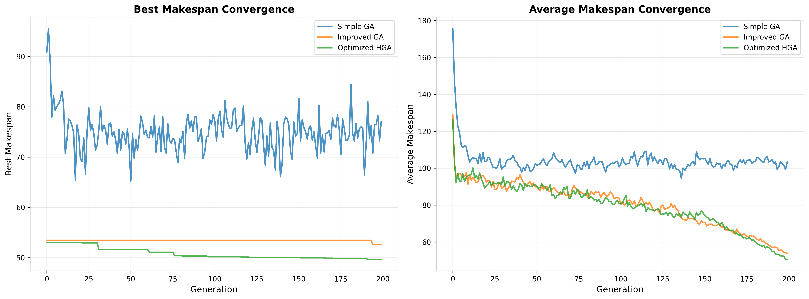

# ☁️ Cloud Task Scheduling with Genetic Algorithms

A Python-based simulation framework that compares three Genetic Algorithm variants — **Simple GA**, **Improved GA**, and **Hybrid GA** — for optimal task scheduling across Virtual Machines (VMs) in cloud environments, with the goal of minimizing **makespan**.

---

## 📌 Table of Contents

- [Overview](#overview)
- [Algorithms](#algorithms)
- [Project Structure](#project-structure)
- [Requirements](#requirements)
- [Results](#results)
- [Parameters](#parameters)
---

## 📖 Overview

Cloud computing environments require efficient task scheduling to maximize resource utilization and minimize job completion time. This project implements and compares three evolutionary optimization approaches:

| Algorithm | Description |
|-----------|-------------|
| **Simple GA** | Baseline Genetic Algorithm with standard crossover and mutation |
| **Improved GA (IGA)** | Enhanced GA with Weighted Round Robin (WRR) initialization |
| **Hybrid GA (HGA)** | GA combined with Local Search for fine-grained optimization |

The primary objective is to minimize the **makespan** — the total time required to complete all tasks assigned to all VMs.

---

## 🧬 Algorithms

### 1. Simple GA
- Random population initialization
- Roulette wheel / tournament selection
- Single-point or uniform crossover
- Standard random mutation

### 2. Improved GA (IGA)
- **Weighted Round Robin** initialization for smarter starting population
- Elitism to preserve best solutions
- Adaptive mutation rate

### 3. Hybrid GA (HGA)
- All features of IGA
- **Local Search** post-processing to escape local optima
- Combines global exploration with local exploitation

---

## 📁 Project Structure
cloud-task-scheduling-ga/

│

├── code.py # Main simulation script (631 lines)

├── requirements.txt # Python dependencies

├── README.md # Project documentation

│

└── results/

├── results.xlsx # Exported comparison results

└── convergence_plot.png # Algorithm convergence visualization

---

## ⚙️ Requirements
- Python 3.8+
- numpy
- matplotlib
- pandas
- openpyxl

---

## ⚙️ Parameters

The following parameters can be modified in `code.py` to test different scenarios:

| Parameter        | Default | Description                              |
|------------------|---------|------------------------------------------|
| `NUM_TASKS`      | 50      | Number of tasks to schedule              |
| `NUM_VMS`        | 10      | Number of Virtual Machines               |
| `POP_SIZE`       | 100     | GA population size                       |
| `GENERATIONS`    | 200     | Number of GA generations                 |
| `MUTATION_RATE`  | 0.01    | Probability of mutation                  |
| `CROSSOVER_RATE` | 0.8     | Probability of crossover                 |
| `NUM_RUNS`       | 10      | Number of independent simulation runs    |

> 💡 You can modify these values directly in `code.py` to experiment with different scheduling scenarios.

---
# 📊 Results

### Convergence Comparison

The following figure shows the convergence behavior of the algorithm:

> 📌 The image is located in the root directory of this repository.

---
### Contact me

 * *[Email](mailto:mrsoheibkiani@gmail.com)*
 * *[Linkedin](https://www.linkedin.com/in/soheibkiani/)*

